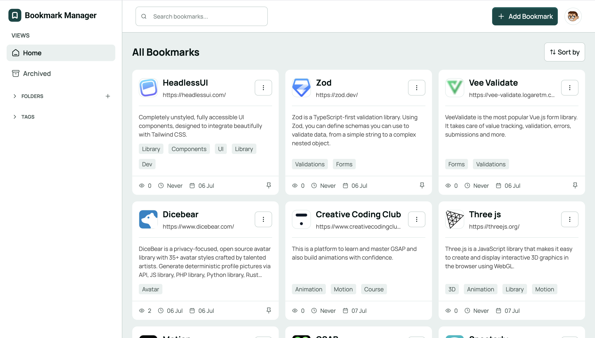

# Bookmark Manager App

A personal bookmark manager web application for saving, organizing, and revisiting your favorite links. Built with Vue 3, Supabase, and Tailwind CSS.

## Table of contents

- [Overview](#overview)
  - [The challenge](#the-challenge)
  - [Screenshot](#screenshot)
  - [Links](#links)
- [My process](#my-process)
  - [Built with](#built-with)
  - [What I learned](#what-i-learned)
  - [Continued development](#continued-development)
  - [Useful resources](#useful-resources)
- [Author](#author)
- [Acknowledgments](#acknowledgments)

## Overview

### The challenge

Users should be able to:

- Sign up, sign in, reset their password, and access protected routes
- Add, edit, delete, pin, and archive bookmarks
- Organize bookmarks into folders and filter them by tags
- Search bookmarks by title, URL, or tags
- Sort bookmarks by recently added, most visited, or recently visited
- Auto-fill bookmark details from a URL using metadata fetching
- Avoid saving duplicate URLs
- Track visit count and last visited date for each bookmark
- Use keyboard shortcuts (`A` to add, `/` to search)
- Switch between light and dark themes
- View the optimal layout for the interface depending on their device's screen size
- See hover and focus states for all interactive elements on the page

### Screenshot

### Links

- Solution URL: [https://github.com/hsu-sam/bookmark-manager-app](https://github.com/hsu-sam/bookmark-manager-app)
- Live Site URL: [Bookmark Manager App](https://bookmarkk-manager-app.vercel.app)

## My process

### Built with

- TypeScript
- Tailwind CSS
- Mobile-first workflow
- Vue 3 (https://vuejs.org/) - JS framework
- Vite (https://vite.dev/) - Build tool
- Supabase (https://supabase.com/) - Auth, database, and Edge Functions
- Vue Router (https://router.vuejs.org/) - Client-side routing
- VeeValidate (https://vee-validate.logaretm.com/) - Form validation
- Radix Vue (https://www.radix-vue.com/) - Accessible UI primitives
- Iconify (https://iconify.design/) - Icons

### What I learned

I learned how to build a full-stack web app with Vue 3 and Supabase — from setting up authentication and row-level security to organizing composables, services, and reusable UI components. I also explored URL normalization for duplicate detection, metadata fetching with Edge Functions, and keyboard shortcuts for a smoother user experience.

### Continued development

I want to keep improving this project by strengthening my Vue and Supabase skills, adding better animations, improving SEO and web accessibility, and making the folder and tag workflows even more flexible.

### Useful resources

- [Vue.js Documentation](https://vuejs.org/) - Helped me understand Vue 3 composition API, reactivity, and component patterns.
- [Supabase Documentation](https://supabase.com/docs) - Useful for auth, database setup, RLS policies, and Edge Functions.
- [Tailwind CSS Documentation](https://tailwindcss.com/docs) - Helped me build a responsive, theme-aware UI quickly.

## Author

- Website - [Samuel Hounsou](https://github.com/hsu-sam)
- GitHub - [@hsu-sam](https://github.com/hsu-sam)

## Acknowledgments

A big thanks to Frontend mentor for their impacts on us developer looking for a way to upskill. Projects like this are a great way to practice real-world full-stack development and improve problem-solving skills.
